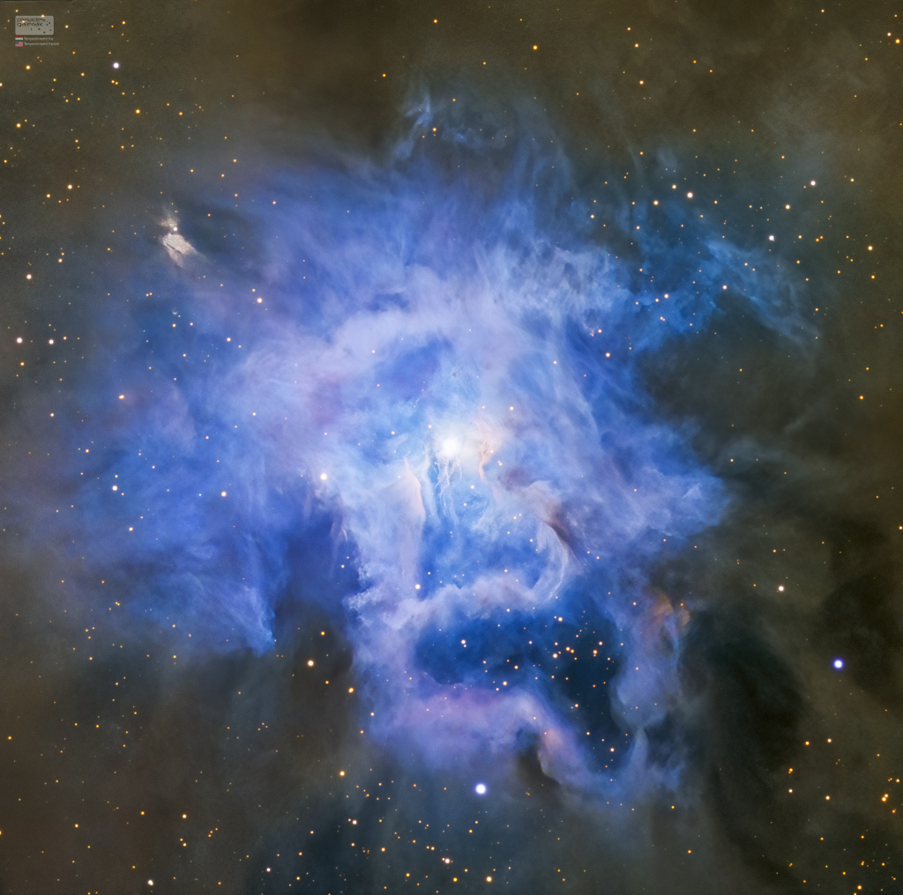

## Конвертируем JSON в строке в Map

https://www.baeldung.com/gson-json-to-map

```xml
<dependency>
  <groupId>com.google.code.gson</groupId>
  <artifactId>gson</artifactId>
  <version>2.10.1</version>
</dependency>
```

## Пишем в файл
https://metanit.com/java/tutorial/6.3.php

## Получаем имя файла из полного пути
https://ru.hexlet.io/qna/java/questions/kak-poluchit-imya-fayla-java
```java
// получаем ОТВЕТ-ДНЯ от Nasa и извлекаем url
Map<String, String> map = gson.fromJson(message, Map.class);
url = map.get("url"); // => https://apod.nasa.gov/apod/image/2309/268_lorand_fenyes_iris_ngc7023_1024.jpg
// извлекаем из url имя файла
File file = new File(url);
String fileName = file.getName();
System.out.println(fileName); // => 268_lorand_fenyes_iris_ngc7023_1024.jpg
```

на сегодня это такая красота :)  

